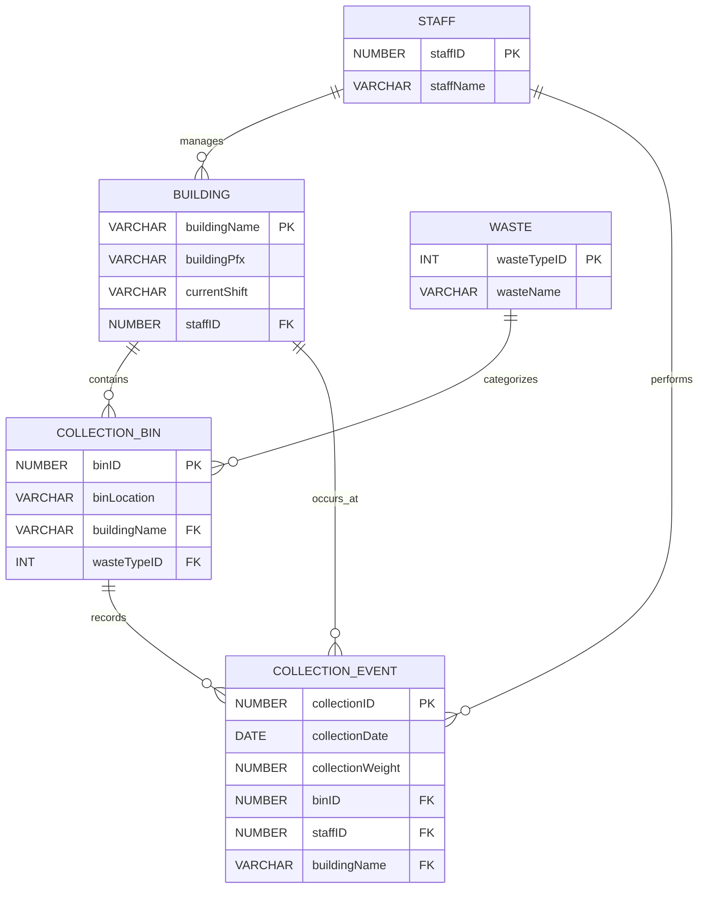

# Waste Management System (WMS)

A centralized data management system designed to support campus sustainability operations by enabling efficient tracking, management, and analysis of waste collection activities.

## Overview

The increasing focus on sustainability and environmental responsibility has made efficient waste management a priority for organizations worldwide. At the University of Michigan–Flint, the Planet Blue initiative oversees waste management operations across campus buildings.

The Waste Management System (WMS) was developed to support these sustainability efforts by providing a structured database solution for recording, managing, and analyzing campus waste data.

The system centralizes information related to:

- Waste types
- Collection activities
- Campus buildings
- Waste bins
- Collection schedules
- Staff responsibilities

By organizing waste management information into a structured database, the system enables improved reporting, operational visibility, and data-driven decision-making to support recycling, composting, and sustainability initiatives.

---

# Project Objectives

The Waste Management System aims to:

- Create a centralized repository for campus waste management data
- Improve accuracy and consistency in waste collection records
- Support reporting and analysis of waste trends
- Enable sustainability teams to monitor operational performance
- Reduce manual tracking processes through structured data management

---

# System Features

## Waste Data Management

The system allows users to manage information related to:

- Waste categories
- Waste collection events
- Collection locations
- Waste containers/bins
- Responsible personnel

## Database Organization

The system uses a structured relational database design to maintain relationships between operational entities.

Key entities include:

- Buildings
- Waste Types
- Bins
- Collection Records
- Staff Members

This relational structure enables efficient querying, reporting, and future system expansion.

## Reporting & Analytics

The system supports analytical workflows by allowing users to:

- Track waste collection activities
- Analyze waste generation patterns
- Monitor recycling and composting efforts
- Generate insights for sustainability planning

# Entity Relationship Diagram (ERD) — Waste Management System

## Database Overview

The Waste Management System (WMS) database supports campus waste tracking by managing:

* Campus buildings
* Waste categories
* Collection bins
* Waste collection staff
* Collection events and measurements

The system enables Planet Blue to monitor waste collection activities, analyze waste trends, and support sustainability decisions.

## ER Diagram



## Entity Description

### Staff

Stores information about employees responsible for building assignments and waste collection activities.

| Attribute | Description                        |
| --------- | ---------------------------------- |
| staffID   | Unique identifier for staff member |
| staffName | Staff member's name                |

---

### Building

Stores campus building information and assigned staff.

| Attribute    | Description                           |
| ------------ | ------------------------------------- |
| buildingName | Primary identifier for building       |
| buildingPfx  | Building abbreviation                 |
| currentShift | Assigned collection shift             |
| staffID      | Staff member responsible for building |

Relationship:

* Each building is assigned to a staff member.
* A staff member may manage multiple buildings.

---

### Waste

Defines available waste categories.

| Attribute   | Description                      |
| ----------- | -------------------------------- |
| wasteTypeID | Unique waste category identifier |
| wasteName   | Waste classification             |

Examples:

* Landfill
* Recyclables
* Cardboard
* Electronic Waste

---

### Collection Bin

Tracks waste containers located across campus.

| Attribute    | Description               |
| ------------ | ------------------------- |
| binID        | Unique bin identifier     |
| binLocation  | Physical location of bin  |
| buildingName | Building where bin exists |
| wasteTypeID  | Type of waste collected   |

Relationships:

* Each bin belongs to one building.
* Each bin collects one waste type.
* A building may contain multiple bins.

---

### Collection Event

Stores individual waste collection records.

| Attribute        | Description                 |
| ---------------- | --------------------------- |
| collectionID     | Unique collection record    |
| collectionDate   | Date of collection          |
| collectionWeight | Measured waste weight       |
| binID            | Bin collected               |
| staffID          | Staff performing collection |
| buildingName     | Location of collection      |

Relationships:

* Each collection event is associated with one bin.
* Each event is performed by a staff member.
* Each event occurs at a building.

```
```


