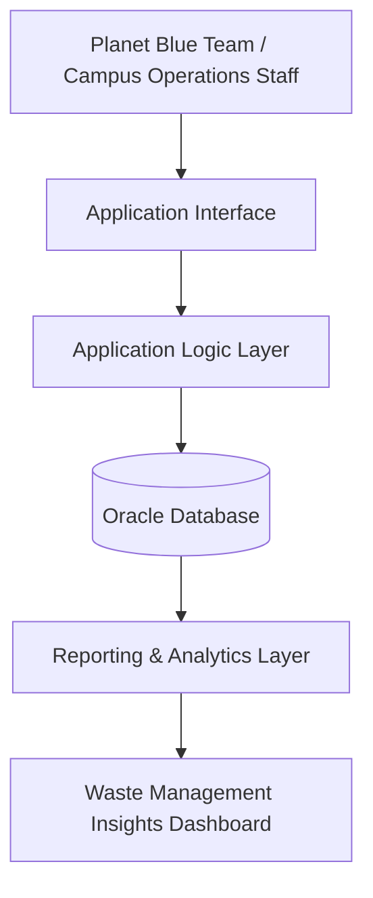
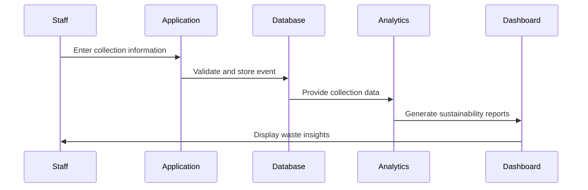

# Waste Management System Architecture

## System Overview

The Waste Management System (WMS) is a database-driven application designed to support campus sustainability initiatives by providing centralized waste collection tracking and analytical capabilities.

The system enables the Planet Blue sustainability team to:

* Record waste collection activities
* Monitor waste generation trends
* Track recycling and landfill activities
* Generate operational reports
* Support data-driven sustainability decisions

---

# High-Level Architecture



---

# Architecture Components

## 1. User Layer

### Users

Primary users include:

* Sustainability coordinators
* Waste management staff
* Campus operations teams

Users interact with the system to:

* Record collection events
* Review waste statistics
* Monitor sustainability progress

---

# 2. Application Layer

The application layer handles business logic between users and the database.

Responsibilities:

* Validate collection records
* Manage CRUD operations
* Enforce system rules
* Retrieve analytical information

Example operations:

* Add new collection event
* Update waste information
* Retrieve building waste history
* Generate reports

---

# 3. Database Layer

The database layer stores all operational data.

## Database Entities

### Staff

Stores employees responsible for waste operations.

---

### Building

Maintains campus building information including:

* Building name
* Building abbreviation
* Assigned shift
* Responsible staff member

---

### Waste

Stores waste classifications:

* Landfill
* Recycling
* Cardboard
* Electronic waste

---

### Collection Bin

Tracks:

* Bin location
* Assigned building
* Waste category

---

### Collection Event

Captures operational waste collection records:

* Collection date
* Weight collected
* Responsible staff
* Associated bin

---

# Data Flow



---

# Data Processing Workflow

1. Waste management staff collect waste from campus locations.
2. Collection details are entered into the system.
3. The application validates:

   * Building information
   * Assigned bin
   * Waste category
   * Staff responsibility
4. Data is stored in the database.
5. Analytics processes collection records.
6. Sustainability teams review trends and make operational decisions.

---

# Future Enhancements

Potential improvements include:

## Analytics Dashboard

Add visualization capabilities for:

* Waste volume trends
* Recycling percentage
* Building-level waste comparison
* Seasonal waste patterns

## Predictive Analytics

Introduce machine learning models to:

* Forecast waste generation
* Optimize collection schedules
* Predict high-volume locations

## IoT Integration

Connect smart bins with sensors to automatically collect:

* Fill levels
* Weight measurements
* Collection timestamps

## Role-Based Access Control

Implement permissions for:

* Administrators
* Collection staff
* Sustainability analysts

---

# Technology Stack

| Layer           | Technology                          |
| --------------- | ----------------------------------- |
| Database        | Oracle SQL                          |
| Data Modeling   | ER Modeling                         |
| Backend         | Application API Layer               |
| Analytics       | SQL Reporting / Visualization Tools |
| Version Control | Git/GitHub                          |

---

# Design Principles

The system follows:

* Relational database normalization principles
* Data integrity through primary and foreign keys
* Separation of operational and analytical concerns
* Scalability for future IoT and AI integrations

```
```
